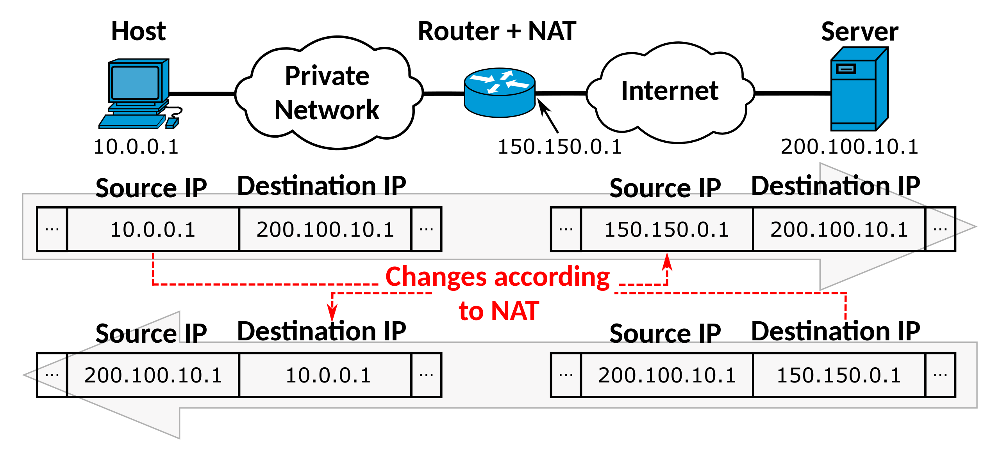

Network address translation (NAT) is a method of mapping an IP address space
into another by modifying network address information in the IP header of
packets while they are in transit across a traffic routing device.[1] The
technique was originally used to bypass the need to assign a new address to
every host when a network was moved, or when the upstream Internet service
provider was replaced, but could not route the network's address space. It has
become a popular and essential tool in conserving global address space in the
face of IPv4 address exhaustion. One Internet-routable IP address of a NAT
gateway can be used for an entire private network.[2]

As network address translation modifies the IP address information in packets,
NAT implementations may vary in their specific behavior in various addressing
cases and their effect on network traffic. The specifics of NAT behavior are
not commonly documented by vendors of equipment containing NAT
implementations.[2]

## Reference

- [https://en.wikipedia.org/wiki/Network_address_translation](https://en.wikipedia.org/wiki/Network_address_translation)